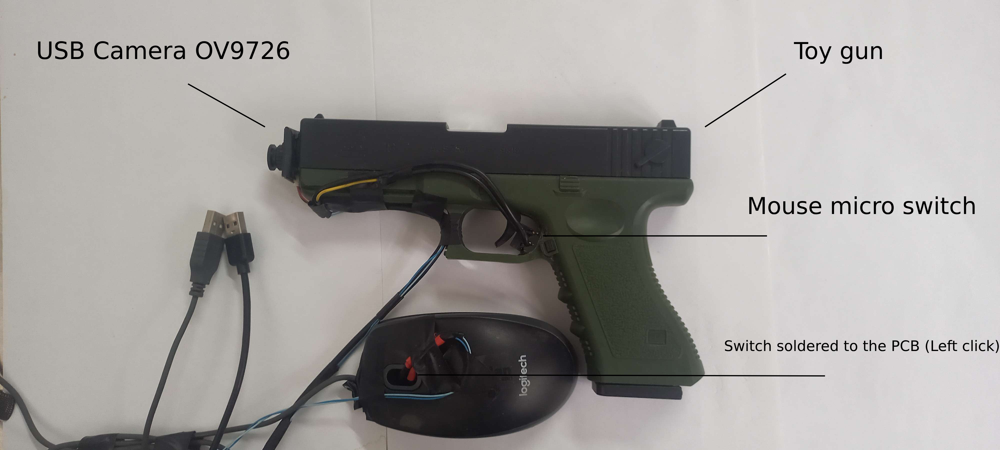
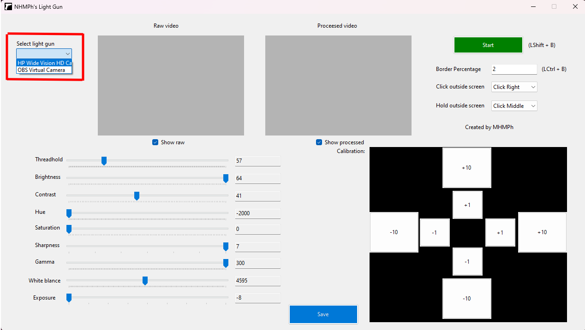
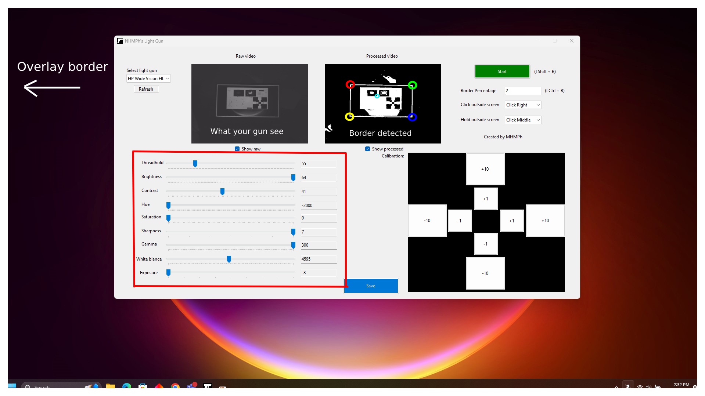
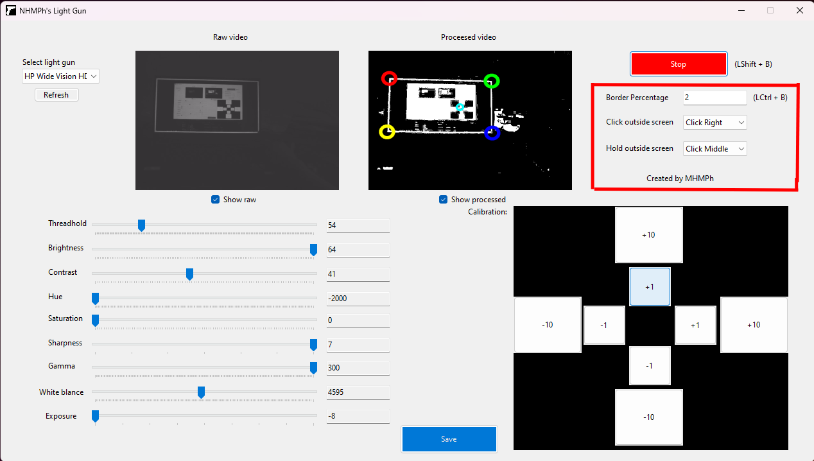

# NHMPh Light gun

## Introduction

Welcome to NHMPh Light gun! 🚀

This repository demonstrates how to play light gun games using a DIY light gun with line-of-sight accuracy, all for under $15.

## How it work

This program utilizes image processing to translate visuals captured by the light gun's webcam into corresponding mouse coordinates.
## Table of Contents
- [Demo]
- [Hardware Set Up]
- [Software Set Up]
---
### 1. **Demo**

  <video src="https://github.com/user-attachments/assets/e1369aea-aada-436b-a1a2-3f85577959a9" controls width="600">
    Your browser does not support the video tag.
  </video>

### 2. **Hardware Set Up**  
The light gun comprises a toy gun, a compact USB webcam (OV9726) and a USB mouse.

The camera is mounted on the barrel, while a switch is securely attached behind the trigger.

The switch is soldered to the PCB, replacing the mouse's left-click

---

### 3. **Software Set Up**  

   - #### 0 Download and open NHMPh Light gun software
     You can compile it yourself or download the RAR file.
  - #### 1 Set up the webcam
    Plug the two USB to your computer and select your light gun's webcam from the options here.

    
    

  - #### 2 Enable the overlay border
     Hold ``LeftCtrl + B`` to enable the overlay border.

     Hold ``LeftCtrl + B`` again to turn it off.

     You can also set the border width to make it more visiable.

     Note: The border will not be visible if the game is in ***fullscreen mode***. Ensure that the game is set to either windowed mode or borderless windowed mode.
     
  - #### 3 Configure the webcam property
    
      

    ** THE LIGHT GUN'S CAMERA NEED TO SEE THE WHITE BORDER EVERY FRAME**
    
     Ensure that the camera can consistently detect the white border on the screen. You should experiment with the threshold, contrast, gamma, and exposure settings to achieve optimal performance.

     You also need to make sure that the light gun's camera is at  [****(1+1/2) * your screen width****] away from your screen.

     Try to move your gun rapidly and adjust the webcam property accordingly.
    
  - #### 4 Start and calibrate the gun

    Start your gun by holding  ``LeftShift + B``

    Note: This will take over your current mouse.
    
    Use your gun sight to adjust the mouse cursor position by clicking/shooting on the (+10 -10 +1 -1) buttons

     

 - #### 5 Have fun
   Be sure to turn on the overlay border when you start your game and save your setting and.
   
   Tips: Open your game and then hold ``LeftCtrl + B`` to enable the overlay border. Then hold ``LeftShift + B`` to start the light gun.

   You can also customize what input will be send when you click/shoot outside of the screen and the border width here.
   
    
   
   I recommend THOTD2, THOTD3, hotd overkill, or any light gun games that can be control with a usb mouse.

