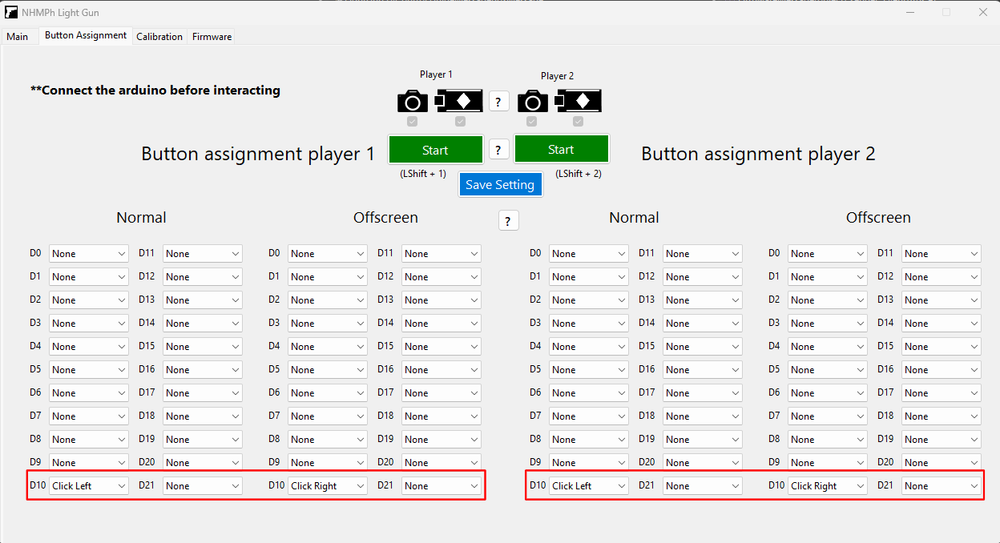

# NHMPh Light gun

## Introduction

Welcome to NHMPh Light gun! 🚀

NHMPh Light gun uses an image processing program and Arduino hardware to convert images captured by the gun's webcam into mouse coordinates, allowing the Arduino to control mouse movement.

## Features

- **2-Player Compatible**: Supports up to two players.
- **Emulators Compatible**: Tested and works with MAME, Flycast, and TeknoParrot. It should also work with other emulators.
- **Cheap parts**: The hardware required to build a functional gun costs less than $20.

## Table of Contents
- [Demo]
- [Hardware Set Up]
- [Software Set Up]
- [Emulators set up]
---

### 1. **Demo**

  <video src="https://github.com/user-attachments/assets/2da292c3-b9d8-47a6-9e46-0306e058dc82" controls width="1280">
    Your browser does not support the video tag.
  </video>
<a href="https://youtu.be/rqIiaASh4KA" target="_blank"><label>Youtube link in case the video doesn't work</label></a>

### 2. **Hardware Set Up**  

#### Hardware build

The light gun comprises a toy gun, a compact USB webcam (OV9726) and a Leonardo pro micro arduino.

The camera is mounted on the barrel, while a switch is securely attached behind the trigger.

The switch is connected to a digital pin on the Arduino.

#### Arduino schematic
For the trigger, connect the common (C) terminal of the micro switch to the Arduino's output voltage pin (Vcc). Attach the normally open (NO) terminal of the switch to the desired digital pin. Additionally, connect a pulldown resistor from that digital pin to the Arduino's ground (GND) pin.
 
 

To connect additional buttons, repeat the same process, but assign each button to a different digital pin on the Arduino.

 

 #### Flashing the arduino

If you're using an Arduino Leonardo pro micro, you can upload the firmware directly through the software. See below for details.

If you're using a different model or encountering issues uploading the firmware through the software, download the Arduino IDE, install the HID-Project library by NicoHood inside arduino library manager ; [ArduinoJoystickLibrary by MHeironimus](https://github.com/MHeironimus/ArduinoJoystickLibrary), and use the provided sketch at 

[/NHMPh/LightGun/tree/main/ArduinoMouseFirmware](https://github.com/NHMPh/LightGun/tree/main/ArduinoMouseFirmware).

 ---
 
**You can rename your gun in certain emulators by modifying the boards.txt file.**

Navigate to: C:\Users\your-name\AppData\Local\Arduino15\packages\arduino\hardware\avr\your-version\boards.txt (default path)

Find the line:
leonardo.build.usb_product="Arduino Leonardo" 

Change it to something like:
leonardo.build.usb_product="NHMPh LightGun P1"

 ---

### 3. **Software Set Up**  

   - #### 0 Download NHMPh Light gun 2 and open the software
     You can compile it yourself or download the RAR file.
  - #### 1 Set up the webcam amd arduino
    Plug the two USB (1 for webcam and 1 for arduino) to your computer and select your light gun's compoment from the options here.
 
    

    Repeat the same process for player 2

- #### 1.1 Upload the firmware

Press the corresponding upload button for Player 1 or Player 2 to upload the firmware to the Arduino if it hasn’t been done already. **This only needs to be done once**.

Wait until the pop-up appears before proceeding.

If you compile the program yourself, create a folder named "ArduinoMouseFirmware" in the same directory as the program's .exe file. Then, download and place the two .hex files from [/NHMPh/LightGun/tree/main/ArduinoMouseFirmware](https://github.com/NHMPh/LightGun/tree/main/ArduinoMouseFirmware) into that folder before pressing the upload button.

 
  
  - #### 2 Enable the overlay border
     Hold ``LeftCtrl + B`` to enable the overlay border.

     Hold ``LeftCtrl + B`` again to turn it off.

     You can also set the border width to make it more visiable.

     Note: The border will not be visible if the game is in ***fullscreen mode***. Ensure that the game is set to either windowed mode or borderless windowed (exclusive window) mode.
     
 - #### 3 Configure the webcam property
    
      

    ** THE LIGHT GUN'S CAMERA NEED TO SEE THE WHITE BORDER EVERY FRAME**
    
     Ensure that the camera can consistently detect the white border on the screen. You should experiment with the threshold, contrast, gamma, and exposure settings to achieve optimal performance.

     You also should make sure that the light gun's camera is at  [****(1+1/2) * your screen width****] (for 70 FOV camera ) away from your screen.

     Try to move your gun rapidly and adjust the webcam property accordingly.
    
 - #### 4 Button assignment
    
      

 You can assign button functions based on the digital pin number connected to each button. "Normal" refers to when the gun is pointed at the screen, while "Offscreen" applies when the gun is aimed away.

For example, i connect a button to digital pin 10 on the Arduino, i can configure it to perform a left mouse click when shooting on-screen and a right click when shooting offscreen (see picture).
    
 - #### 5 Start and calibrate the gun

    Start your gun by holding  ``LeftShift + 1`` for player 1 and  ``LeftShift + 2`` for player 2.

    Note: This will allow the program to take control of your current mouse.
    
    Use the iron sights of your gun to adjust the mouse cursor position, aligning it with the gun’s sight by clicking/shooting the (+10, -10, +1, -1) buttons.

    Make sure to assign your trigger button to "Click Left".

     

 - #### 6 Have fun

   Be sure to turn on the overlay border when you start your game and save your setting.
   
   Tips: Open your game and then hold ``LeftCtrl + B`` to enable the overlay border. Then hold ``LeftShift + 1`` for player 1 and  ``LeftShift + 2`` for player 2 to start the light guns.
   
   
### 4. **Emulators Set Up**  
Setting up this light gun for use with emulators should be similar to configuring the Sinden Light Gun and Gun4IR. You should refer to this wiki [http://sindenwiki.org/wiki](http://sindenwiki.org/wiki) to learn how to properly set up the gun with emulators

